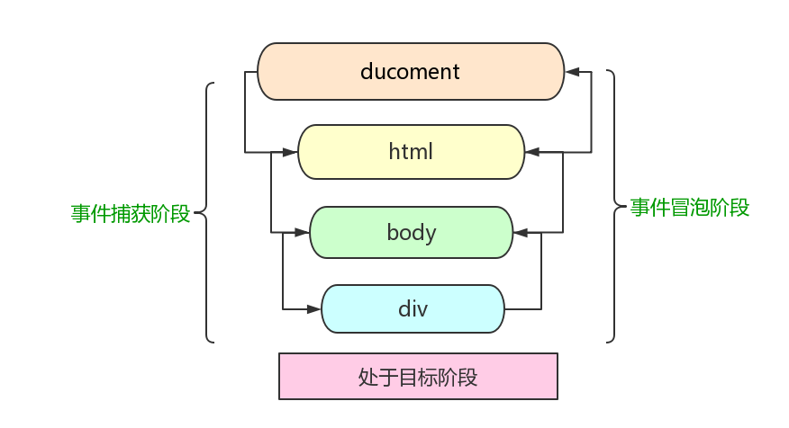

### 事件的三个阶段

1. 捕获
2. 目标阶段执行
3. 冒泡执行

**注意：并不是所有的事件都能冒泡，以下事件不冒泡：blur、focus、load、unload**



### 事件相关方法

普通事件onclick（js）、click（jquery）等，每种事件只能指定一个，重复会被覆盖

事件监听（事件绑定）addEventListener：可指定事件多次，每个事件都会被执行

```javascript
js：
	事件绑定：
	btn.addEventListener("click",fn,false);
	//若要解绑，则需要非匿名函数；false（默认）代表事件会冒泡执行，true为不冒泡
	btn.removeEventListener("click", fn);

jquery：
	事件绑定：
	$("#btn").on("click",fn);   //此处可选择为子元素添加
	事件解绑：
	$("#btn").off("click",fn);  //off();方法为解绑用on绑定的所有事件
	
解除冒泡的方法()：
var fn = function(e){
  e.stopPropagation();
  e.preventDefault();	//阻止默认行为，常用于表单
  e.stopImmediatePropagation()； //阻止剩余的事件处理函数执行并且防止事件冒泡到DOM树上
  return false;  
};
```

### 事件委托

当事件绑定元素太多时，可以对待绑定元素的父元素绑定事件委托，通过event.target来确定具体的绑定子元素